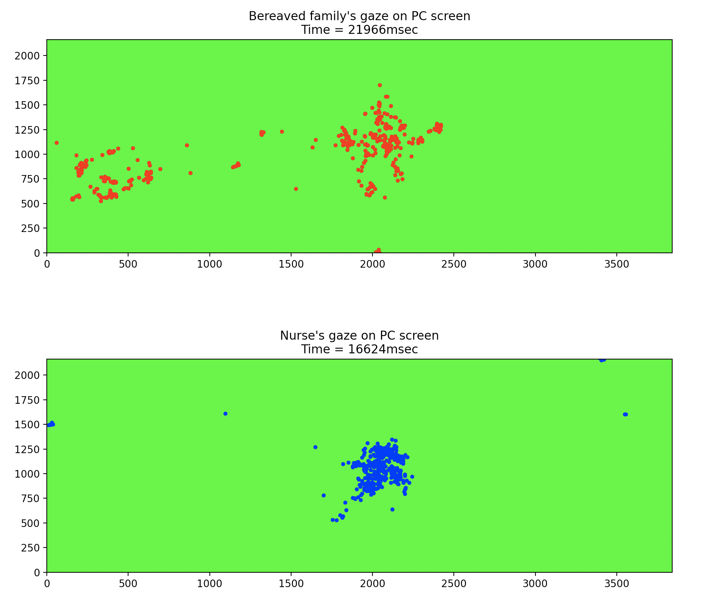

# 視線情報可視化システム

Bereavement Care実施時の視線情報を可視化するシステム<br>
視線情報の獲得にはアイトラッカ（tobii）を使用

# DEMO



# Features

* 動画ファイル上にフィルターとして重ねることで，オンラインでのケア実施時のPC画面上における視線を知ることが可能
* 各視線情報の類似度・同期性を表出化する

# Requirement

* python 3.8.5
* pip 22.0.3
* numpy 1.22.2
* matplotlib 3.5.1
* pandas 1.4.1

# Installation

各webサイト参照<br>
基本的にはpipを使用してインストールすればOK

# Usage

appフォルダにて以下のコマンドを実行

```bash
python visualization.py
```

CLIで表示された質問に答えることで視線情報をプロット

データの処理の流れ
1. visualization
2. diagram
3. gaze

**各ファイルの内容**
- app
    - visualization: 本ファイルを実行することでプログラムが開始するスクリプトを記述
    - diagram: 図のクラスとそのメソッド（図作成・図表示）を記述
    - gaze: CSVファイルから各カラムのデータ取り込み・加工に関するクラスを記述
    - config: 各種設定するための記述 著者以外が編集すべきはこのファイル
- data
    - gaze_b: 遺族の視線情報のCSVファイル
    - gaze_n: 看護師の視線情報のCSVファイル

# Note

注意点

# Author

* 福岡 克也 (Katsuya Fukuoka)
* 大阪府立大学 大学院 人間社会システム科学研究科 瀬田研究室
* katsuofukuoka0225@gmail.com

# License

倫理委員会等